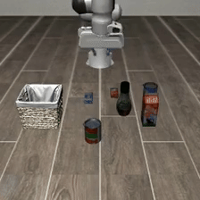
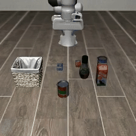
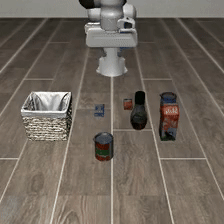
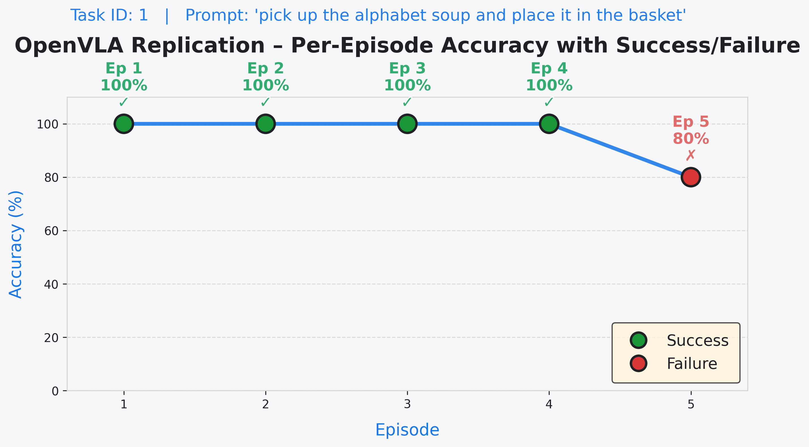

# Take-Home Assignment - Penn State University

## Table of Contents

- [Take-Home Assignment - Penn State University](#take-home-assignment---penn-state-university)
  - [Take-Home Assignment](#take-home-assignment)
  - [Introduction](#introduction)
    - [Types of models that are the SOTA](#types-of-models-that-are-the-sota)
    - [Research Problems](#research-problems)
    - [Generalization Specific Problems](#generalization-specific-problems)
    - [Generalization Problem Choice](#generalization-problem-choice)
  - [Literature Work](#literature-work)
    - [Top Models](#top-models)
    - [Datasets and Benchmarks](#datasets-and-benchmarks)
    - [Latest Research Papers on Generalization](#latest-research-papers-on-generalization)
  - [Replication](#replication)
    - [Constraints](#constraints)
    - [Approaches Taken due to Constraints](#approaches-taken-due-to-constraints)
    - [Configurations](#configurations)
    - [Results Logs](#results-logs)
    - [Comparison with paper results](#comparison-with-paper-results)
    - [Sample Outputs](#sample-outputs)
  - [New Ideas](#new-ideas)
  - [To-Do / Progress Checklist](#to-do--progress-checklist)

## Take-Home Assignment:

> **Take-home assignment**: Choose one specific generalization problem in the areas of embodied AI or robotics, and finish the following.  
> - Identify the SOTA method  
> - Replicate the code  
> - Propose some new ideas  
> - Implement one specific idea  

## Introduction

The current paradigm is to merge everything (control, perception, reasoning and language) into one unified model.

### Types of models that are the SOTA:
- Vision Language Action Models (VLAs)
- World Models

**Vision Language Action Models**: Vision-Language-Action (VLA) models unify perception and motor control into a single transformer-based architecture.

**World Models**: These understand the dynamics of the real world, including physics and spatial properties through input data, including text, image, video, and movement, to generate videos that simulate realistic physical environments. World models are used to generate custom synthetic data or downstream AI models for training robots and autonomous vehicles.

World models are often used to generate data, latent rollouts, or representations that can be integrated into or fine-tuned with VLA-style policies.

### Research Problems

Some problems that are the main focus right now in the research community:

- Lack of Physical Data for large-scale generalization
- Cross-Embodiment Generalization
- Zero-shot Task Generalization
- Sim2Real Transfer
- Reasoning and Self-correction

### Generalization Specific Problems:
- Cross-Embodiment Generalization
- Sim2Real Transfer
- Zero-shot Task Generalization

> ## Generalization Problem Choice:
> There are two problems that I find most interesting and are the most important ones right now: 
> - Cross-Embodiment Generalization
> - Zero-shot Task Generalization. 

**Background**: While current models can perform tasks they were specifically trained for (in-distribution), the "holy grail" of the field is enabling a robot to perform a task it has never seen before, using a body (morphology) it was not trained on. The central challenge is to overcome the Out-of-Distribution (OOD) Gap. This is not just about recognizing a new image, it is about generalist models that can do the following: 

- Generalize to Novel Tasks: Following a language command for a skill, like "zest the lemon", without ever having seen a single demonstration of "zesting."

- Generalize to Unseen Environments: Operating in a new kitchen or warehouse (essentially a new environment) with different lighting and layouts without any priors about mapping.

- Cross-Embodiment Transfer: A single AI "brain" controlling different robots, such as a humanoid-arm, an entire humanoid, or a mobile platform, without being fine-tuned for each specific hardware's physics.

> To Sum-up in technical terms: Training a single policy that can generalize across different robot morphologies (different arms, grippers, mobile bases, humanoids) without retraining.

## Literature Work:

### Top Models:

| Name    | Description  | Type          | Paper/Website Link | GitHub Link                                           |
|---------|--------------|---------------|--------------------|-------------------------------------------------------|
| OpenVLA | An Open-Source Vision-Language-Action Model | Model         | [ArXiv](https://arxiv.org/abs/2406.09246) | [GitHub](https://github.com/openvla/openvla)           |
| π0      | A Vision-Language-Action Flow Model for General Robot Control | Model         | [Website](https://www.pi.website/download/pi0.pdf)      | Proprietary |
| RDT2    | Enabling Zero-Shot Cross-Embodiment Generalization by Scaling Up UMI Data | Model & Data   | [Website](https://rdt-robotics.github.io/rdt2/#)      | [GitHub](https://github.com/thu-ml/RDT2)               |
| Nvidia Groot N1   | Open vision-language-action (VLA) model for generalized humanoid robot skills | Model & Data | [Paper](https://arxiv.org/abs/2503.14734)  |   [GitHub](https://github.com/NVIDIA/Isaac-GR00T?tab=readme-ov-file)  |
| ECoT    |   OpenVLA-based Embodied Chain-of-Thought |   Model & Data    | [Paper](https://arxiv.org/pdf/2407.08693) | [GitHub](https://github.com/MichalZawalski/embodied-CoT/)   |

### Datasets and Benchmarks:
| Name  | Link |
|-------|------|
| Open X-Embodiment: Robotic Learning Datasets and RT-X Models | [Website](https://robotics-transformer-x.github.io/) |
| RDT2: Enabling Zero-Shot Cross-Embodiment Generalization by Scaling Up UMI Data | [Website](https://rdt-robotics.github.io/rdt2/#) | 
| LIBERO | [Website](https://libero-project.github.io/main.html) | 

### Latest Research Papers on Generalization:
| Name    |     Venue     | Paper/Website Link | GitHub Link |
|---------|---------------|------------------|------------|
| OpenVLA |      CoRL     | [ArXiv](https://arxiv.org/abs/2406.09246) | [GitHub](https://github.com/openvla/openvla)           |
| Robotics Control via Embodied Chain of Thought Reasoning | CoRL | [PDF](./Literature_Review/Papers/2407.08693v3.pdf) | [Embodied-CoT](https://github.com/MichalZawalski/embodied-CoT/) |
| TrackVLA++: Unleashing Reasoning and Memory Capabilities in VLA Models for Embodied Visual Tracking | ArXiv | [PDF](./Literature_Review/Papers/2510.07134.pdf) | Not Released Yet |
| DEEPTHINKVLA: ENHANCING REASONING CAPABILITY OF VISION-LANGUAGE-ACTION MODELS | ArXiv | [PDF](./Literature_Review/Papers/2511.15669.pdf) | [DeepThinkVLA](https://github.com/OpenBMB/DeepThinkVLA) |
| ManualVLA: A Unified VLA Model for Chain-of-Thought Manual Generation and Robotic Manipulation | ArXiv | [PDF](./Literature_Review/Papers/2512.02013.pdf) | Not Released Yet |

---
 

## Replication:
- Selected the [OpenVLA](https://github.com/openvla/openvla) as the main replication code, because it is being used by almost every other paper for baseline.
- Selected LIBERO for evaluation as it is based on a simulation-based robot arm. The main benchmark `BridgeData V2 WidowX` that is used in the paper is based on having an actual robot which is not feasible.
 
### ⚠️ **Constraints** ⚠️

- My local hardware (laptop and PC) did not have sufficient VRAM to run the OpenVLA-7B model.
- Used Google Colab, which provides only Nvidia `T4 GPUs` (15GB VRAM).
- Colab's Nvidia T4 architecture does not support flash-attention (requires Ampere or newer).
- `bitsandbytes` is also incompatible with OpenVLA's environment, so reduced/quantized precision could not be used.
- Due to Colab limitations, long-running jobs are frequently interrupted (no background execution, session timeouts).

### ✅ Approaches Taken due to Constraints

- Restricted model execution to full precision only (no quantization, no flash-attention), for compatibility and correctness.
- Reduced evaluation load by running only **1 task** and **5 episodes** (instead of the original 10 tasks x 50 episodes), to ensure at least partial results could be completed within Colab's session limits.
- Prioritized demonstration of reproducibility and trend alignment with reported results, rather than aiming for exhaustive/statistically significant benchmarking.
- Chose OpenVLA because of its use as a primary baseline in much of the literature, and adapted its setup scripts for Colab execution by following the installation constraints above.

### Configurations:
- `Model`: `openvla/openvla-7b-finetuned-libero-object`
- `Task`: `libero-object`
- `Tasks_ID`: 1
- `Episodes`: 5
- `Model Precision`: Full 16-bit

### Results Logs:
| Task id | Episode # | Task Prompt | Success | Accuracy &uarr; |
|--------|-----------|-------------|---------|---------|
| 1 | 1 | pick up the alphabet soup and place it in the basket | True | 100% |
| 1 | 2 | pick up the alphabet soup and place it in the basket | True  | 100% |
| 1 | 3 | pick up the alphabet soup and place it in the basket | True  | 100% |
| 1 | 4 | pick up the alphabet soup and place it in the basket | True  | 100% |
| 1 | 5 | pick up the alphabet soup and place it in the basket | False  | 80% |

### Comparison with paper results:
| Paper Accuracy | Replication Accuracy |
|----------------|----------------------|
|  88.4% | 80% |

The numbers are mentioned here: [Paper Results Table](https://github.com/openvla/openvla?tab=readme-ov-file#openvla-fine-tuning-results)
These results are based on 10 Tasks and 50 episodes per task and Replication results are based on only 1 Task and 5 episodes because of the the resources that I had access to, to replicate these results. Unfortunately, Google Colab keep running out of credits and I have to wait hours to try again later. 

> Given the very small number of episodes, these results are not statistically significant and are only meant to verify correctness of the setup and trend-level consistency with reported results.

<h1>Sample Outputs</h1>
<h2>Task Prompt: pick up the alphabet soup and place it in the basket</h2>

|  |  |  |
|:--:|:--:|:--:|
| **Episode:** 1, **Task:** 1, **Success:** True | **Episode:** 3, **Task:** 1, **Success:** True | **Episode:** 5, **Task:** 1, **Success:** False |

<h2>Results Graph</h2>

  

    
  

 

## New Ideas:

These ideas should not require huge amount of compute, preferably within Google Colab, otherwise it would be impossible to do anything that requires a lot of compute and time.

1. Language Perturbation - Instruction-level distribution shift
    - Check the performance of the model perturbation of Task Prompt. Use another model to apply perturbation on runtime while keep the main goal intact. This will test the robustness of the model to language perturbation to effectively show model's zero-shot performance on the same task and goal but different and slightly confusing wording.  
2. Visual Inconsistency Invariance:
    - Check model's robustness to visual changes that are not in the original dataset like changing the color of the basket's or soup's texture. This will test the model's vision generalization ability.  

## To-Do / Progress Checklist
- [x] Literature Review  
- [x] Identification of SOTA methods  
- [x] Code Replication (OpenVLA code will be uploaded soon)
- [x] New Ideas  
- [ ] Implementation of One New Idea  
